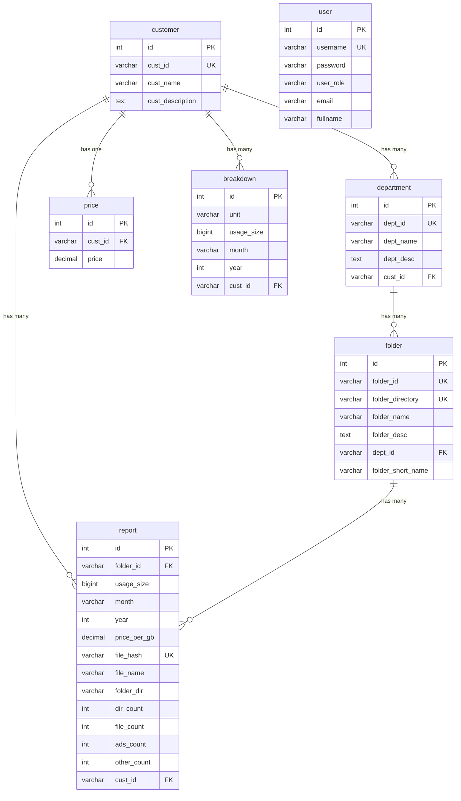
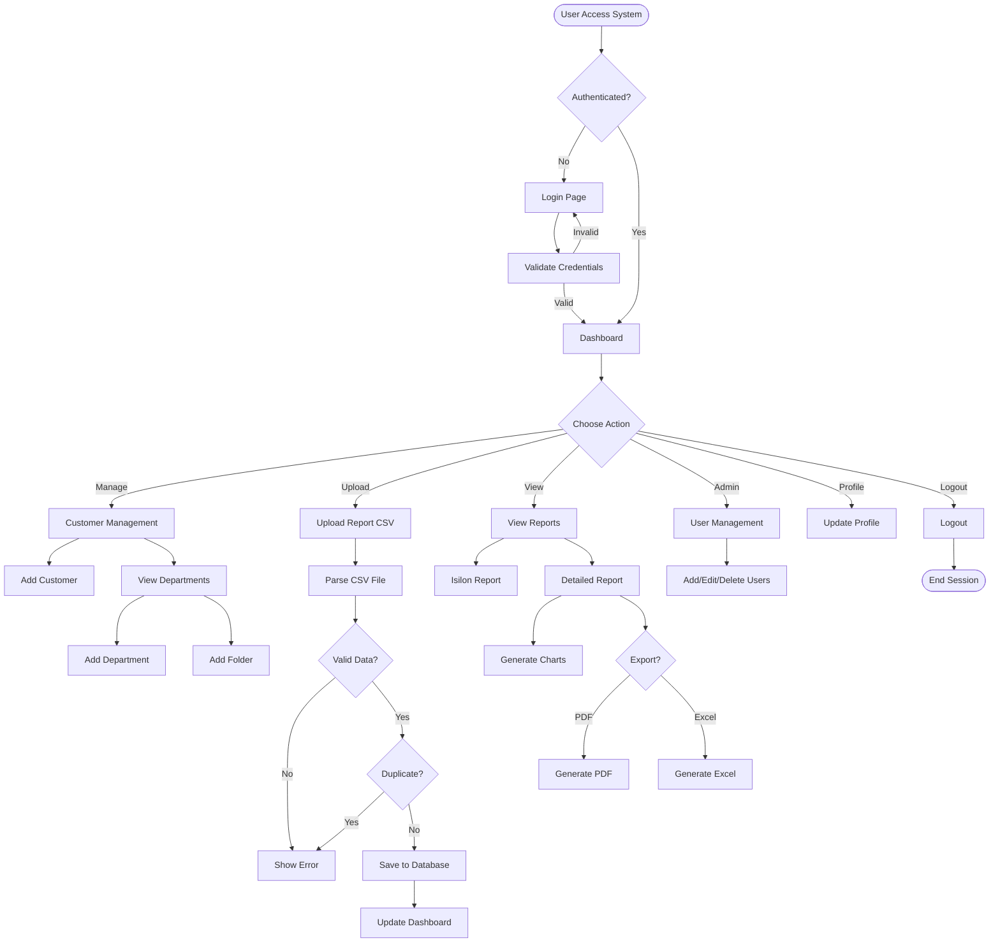
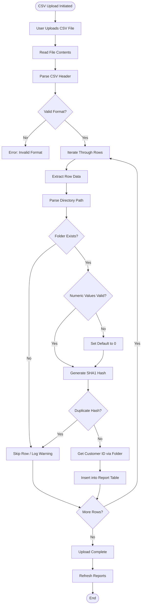
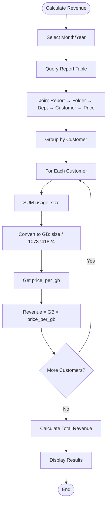
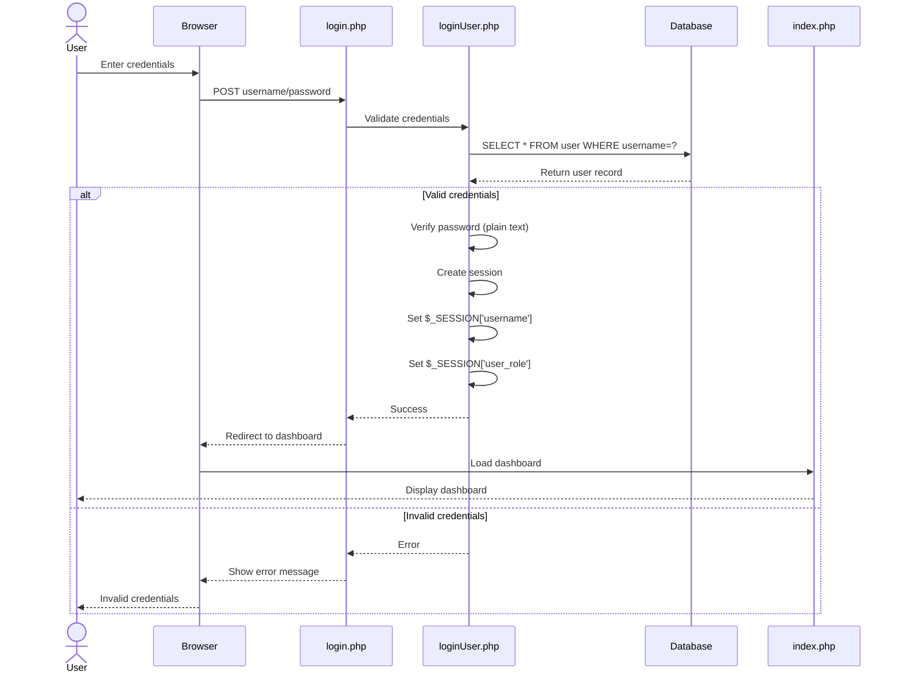
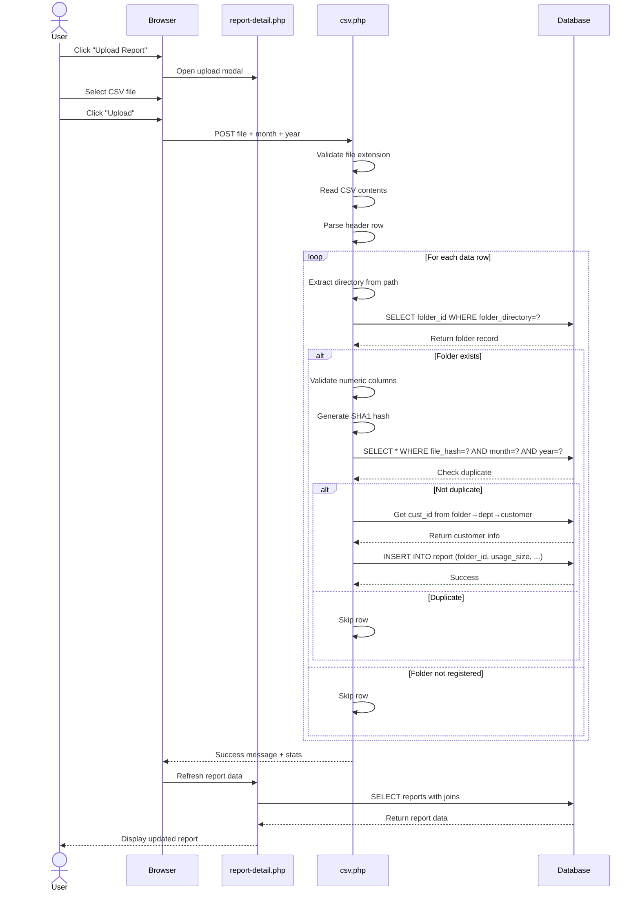
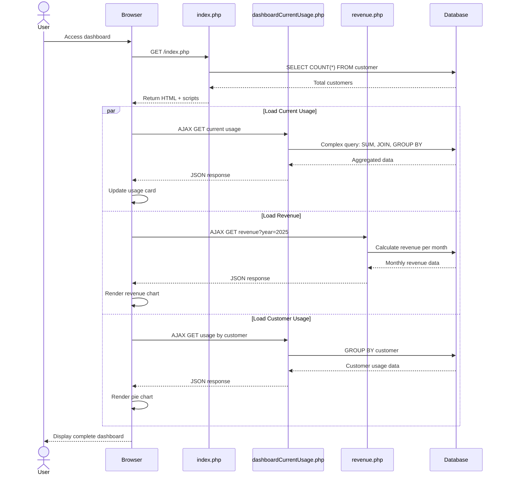
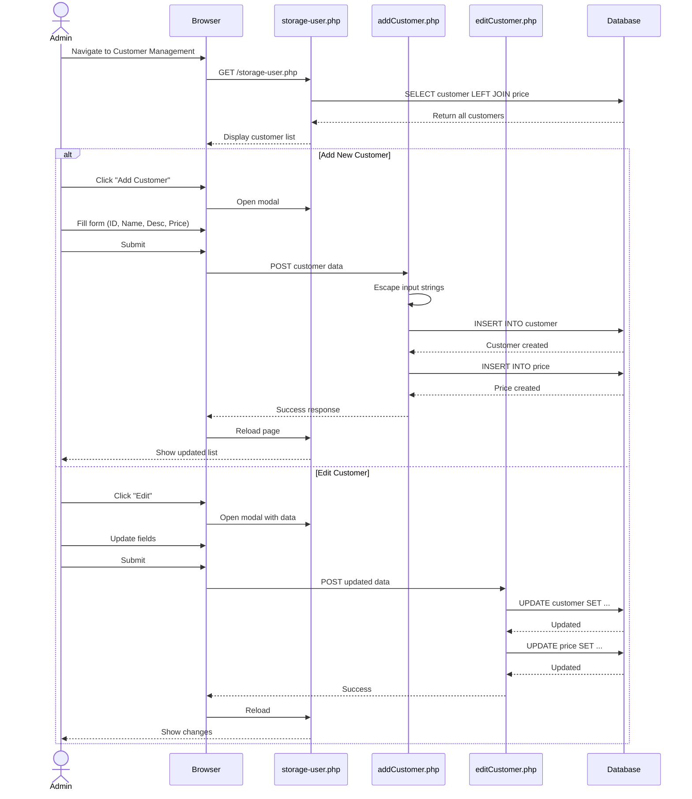
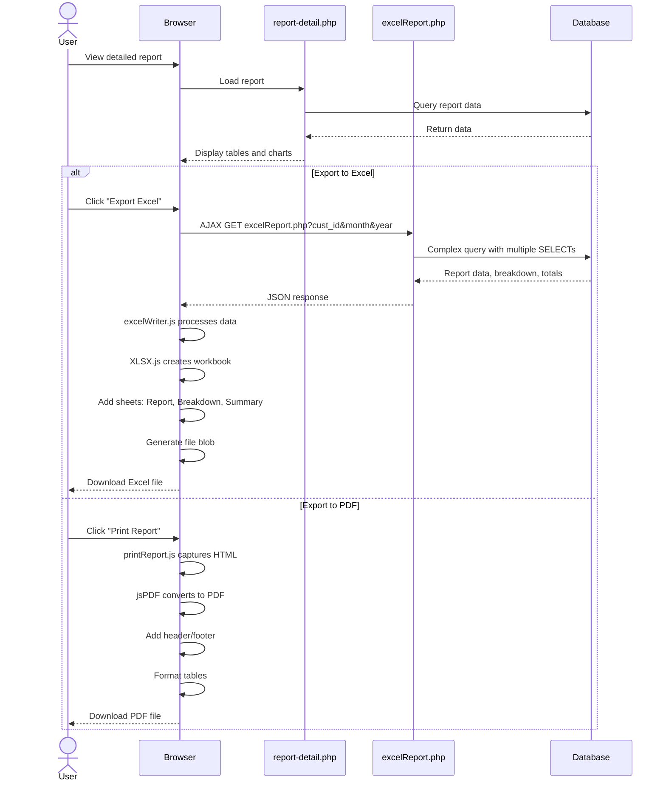

# ESAS - Enterprise Storage Analytics System

[](https://php.net)
[](https://mysql.com)
[]()

A comprehensive web-based cloud storage management system designed to track, analyze, and report on storage usage across multiple customers. ESAS processes storage reports from Isilon storage systems, calculates costs based on usage, and generates detailed reports with visualizations.

---

## Table of Contents

- [Features](#features)
- [Technology Stack](#technology-stack)
- [System Architecture](#system-architecture)
- [Database Schema (ERD)](#database-schema-erd)
- [System Flow Diagram](#system-flow-diagram)
- [Sequence Diagrams](#sequence-diagrams)
- [Installation](#installation)
- [Configuration](#configuration)
- [Usage Guide](#usage-guide)
- [API Endpoints](#api-endpoints)
- [Security Considerations](#security-considerations)
- [Project Structure](#project-structure)
- [Contributing](#contributing)

---

## Features

### Core Functionality

- **Customer Management**: Hierarchical organization (Customer → Department → Folder)
- **Report Processing**: Automated CSV upload and processing from Isilon storage systems
- **Usage Analytics**: Real-time storage usage tracking and visualization
- **Revenue Calculation**: Automatic billing based on usage and customer pricing
- **Multi-format Export**: PDF and Excel report generation
- **User Management**: Role-based access control (Admin/User)
- **Dashboard Analytics**: Visual charts and statistics
- **Duplicate Prevention**: File hash-based duplicate detection

### Reporting Capabilities

1. **Dashboard Overview**: Total customers, usage, and revenue with trend charts
2. **Isilon Reports**: Detailed storage usage by folder and department
3. **Workfolder Summary**: Visual breakdown of storage by workflow folder
4. **Departmental Summary**: Aggregated storage by department
5. **Business Unit Breakdown**: Production unit-level analysis

---

## Technology Stack

### Backend
- **PHP 8.x**: Server-side scripting
- **MySQL/MariaDB**: Relational database
- **Apache**: Web server (XAMPP)
- **MySQLi**: Database driver

### Frontend
- **HTML5/CSS3**: Markup and styling
- **Bootstrap 4**: Responsive framework
- **JavaScript**: Client-side scripting

### JavaScript Libraries
- **jQuery 3.x**: DOM manipulation
- **DataTables**: Advanced table management
- **Chart.js**: Data visualization
- **Morris.js**: Time-series charts
- **C3.js**: D3-based charts
- **jsPDF**: PDF generation
- **XLSX.js**: Excel export
- **Feather Icons**: Icon library

---

## System Architecture

```
┌─────────────────────────────────────────────────────────────┐
│                      User Interface Layer                   │
│  (HTML/CSS/Bootstrap + JavaScript/jQuery + Charts)          │
└───────────────────────┬─────────────────────────────────────┘
                        │ HTTP/AJAX
┌───────────────────────┴─────────────────────────────────────┐
│                   Application Layer (PHP)                   │
│  ┌──────────────┐  ┌──────────────┐  ┌──────────────┐      │
│  │Authentication│  │   Modules    │  │   Reports    │      │
│  │   System     │  │   (CRUD)     │  │  Processing  │      │
│  └──────────────┘  └──────────────┘  └──────────────┘      │
└───────────────────────┬─────────────────────────────────────┘
                        │ MySQLi
┌───────────────────────┴─────────────────────────────────────┐
│                    Data Layer (MySQL)                       │
│  ┌──────────┐ ┌──────────┐ ┌──────────┐ ┌──────────┐       │
│  │ customer │ │department│ │  folder  │ │  report  │       │
│  └──────────┘ └──────────┘ └──────────┘ └──────────┘       │
│  ┌──────────┐ ┌──────────┐ ┌──────────┐                    │
│  │  price   │ │breakdown │ │   user   │                    │
│  └──────────┘ └──────────┘ └──────────┘                    │
└─────────────────────────────────────────────────────────────┘
```

### Data Hierarchy

```
Customer (e.g., Media Prima)
    │
    ├── Department (Production, Archive, News, Engineering)
    │       │
    │       └── Folder (/ifs/Dalet/DPSHARE/RSU)
    │               │
    │               └── Report (Monthly usage data)
    │
    └── Price (RM per GB)
```

---

## Database Schema (ERD)



### Table Relationships

| Relationship | Type | Foreign Key |
|-------------|------|-------------|
| customer → department | One-to-Many | department.cust_id |
| customer → price | One-to-One | price.cust_id |
| customer → report | One-to-Many | report.cust_id |
| customer → breakdown | One-to-Many | breakdown.cust_id |
| department → folder | One-to-Many | folder.dept_id |
| folder → report | One-to-Many | report.folder_id |

---

## System Flow Diagram

### Overall System Flow



### CSV Upload and Processing Flow



### Revenue Calculation Flow



---

## Sequence Diagrams

### 1. User Login Sequence



### 2. CSV Upload and Report Processing Sequence



### 3. Dashboard Data Loading Sequence



### 4. Customer Management Sequence



### 5. Report Export Sequence



---

## Installation

### Prerequisites

- **XAMPP** (or equivalent) with:
  - PHP 8.0 or higher
  - MySQL 5.7 or higher
  - Apache 2.4 or higher
- Web browser (Chrome, Firefox, Edge)

### Step-by-Step Installation

1. **Clone or Download the Project**
   ```bash
   cd c:\xampp\htdocs
   git clone <repository-url> esas
   # OR extract ZIP to c:\xampp\htdocs\esas
   ```

2. **Start XAMPP Services**
   - Start Apache
   - Start MySQL

3. **Create Database**
   ```sql
   -- Access phpMyAdmin or MySQL CLI
   CREATE DATABASE esas CHARACTER SET utf8mb4 COLLATE utf8mb4_unicode_ci;
   ```

4. **Import Database Schema**
   ```bash
   # Option 1: Using phpMyAdmin
   # - Navigate to http://localhost/phpmyadmin
   # - Select 'esas' database
   # - Click 'Import'
   # - Choose SQL file from project root
   # - Click 'Go'

   # Option 2: Using MySQL CLI
   mysql -u root -p esas < c:\xampp\htdocs\esas\esas.sql
   ```

5. **Configure Database Connection**

   Edit `connection/connection.php`:
   ```php
   <?php
   $host = "localhost";
   $user = "root";
   $pass = "your_password"; // Change if you set MySQL password
   $db = "esas";
   ```

6. **Set Folder Permissions**

   Ensure the `reports/` directory is writable:
   ```bash
   # Windows: Right-click → Properties → Security → Edit
   # Grant write permissions to Apache user

   # Linux/Mac:
   chmod 755 reports/
   ```

7. **Access the Application**

   Navigate to: `http://localhost/esas`

8. **Default Login Credentials**

   **Admin Account:**
   - Username: `admin`
   - Password: `admin123`

   ⚠️ **Important**: Change the default password immediately after first login!

---

## Configuration

### Database Configuration

File: `connection/connection.php`

```php
<?php
session_start();

$host = "localhost";      // Database host
$user = "root";           // Database username
$pass = "";               // Database password
$db = "esas";             // Database name

$conn = mysqli_connect($host, $user, $pass, $db);

if (!$conn) {
    die("Connection failed: " . mysqli_connect_error());
}
?>
```

### Session Configuration

Sessions are automatically started in `connection.php`. Default PHP session settings apply.

To customize session timeout, add to `php.ini`:
```ini
session.gc_maxlifetime = 3600  ; 1 hour
session.cookie_lifetime = 0    ; Until browser closes
```

### CSV Upload Configuration

Maximum file size is controlled by PHP settings in `php.ini`:
```ini
upload_max_filesize = 50M
post_max_size = 50M
max_execution_time = 300
memory_limit = 256M
```

### Price Precision

Price per GB is stored as `DECIMAL(10,4)`:
- Supports up to 999,999.9999 RM/GB
- 4 decimal places precision

### Date Format

Reports use:
- Month: `01` to `12` (zero-padded)
- Year: `YYYY` (4-digit)

---

## Usage Guide

### 1. First Time Setup

1. **Login as Admin**
   - URL: `http://localhost/esas`
   - Use default credentials

2. **Change Password**
   - Navigate to Profile
   - Update password

3. **Add First Customer**
   - Go to Storage → Customer Management
   - Click "Add Customer"
   - Fill in:
     - Customer ID: `mp` (short identifier)
     - Customer Name: `Media Prima`
     - Description: Company details
     - Price per GB: `0.0280`
   - Submit

4. **Add Departments**
   - Click on customer name
   - Click "Add Department"
   - Example:
     - Department ID: `mp_prod`
     - Name: `Production`
     - Description: Production department
   - Repeat for all departments

5. **Add Folders**
   - Under each department, click "Add Directory"
   - Example:
     - Folder ID: `mp_prod_rsu`
     - Directory: `/ifs/Dalet/DPSHARE/RSU`
     - Name: `RSU Workfolder`
     - Short Name: `RSU`
   - This directory must match the path in CSV files

### 2. Uploading Storage Reports

1. **Navigate to Reports**
   - Dashboard → Report Detail
   - Select customer and month

2. **Upload CSV**
   - Click "Upload Report"
   - Select CSV file from Isilon
   - System will:
     - Parse CSV
     - Match directories
     - Calculate totals
     - Prevent duplicates

3. **CSV Format Required**
   ```csv
   path[directory:/ifs/],dir_cnt (count),file_cnt (count),ads_cnt,other_cnt (count),phys_size_sum (bytes),log_size_sum_overflow,report_date
   /ifs/Dalet/DPSHARE/RSU,56928,1134360,0,0,63379172920832,0,2025-01-31
   /ifs/NRCS,1,58107,0,0,481850828152832,0,2025-01-31
   ```

4. **Verify Upload**
   - Check Isilon Report section
   - Verify totals
   - Check charts updated

### 3. Viewing Reports

**Dashboard Overview**
- Shows: Total customers, total usage, total revenue
- Charts: Usage by customer, revenue trends, storage trends

**Isilon Report**
- Simple table view
- Filter by month/year
- Shows all folders

**Detailed Report**
- Comprehensive view with 4 sections:
  1. Isilon data table
  2. Workfolder summary (chart)
  3. Departmental summary (chart)
  4. Business unit breakdown (if applicable)

**Export Options**
- PDF: Print entire report
- Excel: Download with multiple sheets

### 4. User Management (Admin Only)

1. **Add User**
   - Users → Add User
   - Fill in: Username, Email, Full Name, Password, Role
   - Submit

2. **Edit User**
   - Click edit icon
   - Update fields
   - Save

3. **Delete User**
   - Click delete icon
   - Confirm
   - Note: Cannot delete yourself

4. **Roles**
   - `admin`: Full access
   - `user`: Read-only, no user management

### 5. Monthly Workflow

**Recommended Process:**

1. **Start of Month**
   - Export Isilon reports for previous month
   - Prepare CSV files per customer

2. **Upload Reports**
   - Log into ESAS
   - For each customer:
     - Navigate to Report Detail
     - Select previous month
     - Upload CSV
     - Verify data

3. **Review Dashboard**
   - Check total usage
   - Verify revenue calculations
   - Compare with previous months

4. **Generate Reports**
   - For each customer:
     - View detailed report
     - Export to PDF for records
     - Export to Excel for analysis

5. **Billing**
   - Use revenue figures from dashboard
   - Detailed breakdown available in Excel exports

---

## API Endpoints

### Authentication

| Endpoint | Method | Parameters | Response |
|----------|--------|------------|----------|
| `/authentication/loginUser.php` | POST | `username`, `password` | Session creation |
| `/authentication/logout.php` | GET | - | Session destroy + redirect |

### Customer Management

| Endpoint | Method | Parameters | Response |
|----------|--------|------------|----------|
| `/module/addCustomer.php` | POST | `custID`, `custName`, `custDesc`, `price` | Success/error JSON |
| `/module/editCustomer.php` | POST | `custID`, `custName`, `custDesc`, `price` | Success/error JSON |
| `/module/deleteCustomer.php` | POST | `custID` | Success/error JSON |

### Department Management

| Endpoint | Method | Parameters | Response |
|----------|--------|------------|----------|
| `/module/addDepartment.php` | POST | `deptID`, `deptName`, `deptDesc`, `custID` | Success/error JSON |
| `/module/editDepartment.php` | POST | `deptID`, `deptName`, `deptDesc` | Success/error JSON |
| `/module/deleteDepartment.php` | POST | `deptID` | Success/error JSON |

### Folder Management

| Endpoint | Method | Parameters | Response |
|----------|--------|------------|----------|
| `/module/addDirectory.php` | POST | `folderID`, `folderDir`, `folderName`, `folderDesc`, `folderShortName`, `deptID` | Success/error JSON |
| `/module/editDirectory.php` | POST | Same as add | Success/error JSON |
| `/module/deleteDirectory.php` | POST | `folderID` | Success/error JSON |

### Report Management

| Endpoint | Method | Parameters | Response |
|----------|--------|------------|----------|
| `/module/csv.php` | POST | `csvFile`, `month`, `year` | Success/error JSON |
| `/module/csv2.php` | POST | `csvFile`, `month`, `year`, `custID` | Success/error JSON |
| `/module/deleteReport.php` | POST | `id` | Success/error JSON |
| `/module/excelReport.php` | GET | `cust_id`, `month`, `year` | JSON data |

### Dashboard APIs

| Endpoint | Method | Parameters | Response |
|----------|--------|------------|----------|
| `/module/dashboardCurrentUsage.php` | GET | - | JSON: total usage in GB |
| `/module/revenue.php` | GET | `year` | JSON: monthly revenue array |

### User Management

| Endpoint | Method | Parameters | Response |
|----------|--------|------------|----------|
| `/module/userAdd.php` | POST | `username`, `email`, `fullname`, `password`, `user_role` | Success/error JSON |
| `/module/userUpdate.php` | POST | `id`, `username`, `email`, `fullname`, `user_role` | Success/error JSON |
| `/module/userDelete.php` | POST | `id` | Success/error JSON |
| `/module/passwordUpdate.php` | POST | `id`, `currentPassword`, `newPassword` | Success/error JSON |

---

## Security Considerations

### Current Security Issues ⚠️

1. **Plain Text Passwords**
   - Passwords stored without hashing
   - Recommendation: Implement `password_hash()` and `password_verify()`

2. **SQL Injection Vulnerability**
   - Uses `mysqli_escape_string()` but with string concatenation
   - Recommendation: Use prepared statements (mysqli or PDO)

3. **No CSRF Protection**
   - Forms lack CSRF tokens
   - Recommendation: Implement token-based CSRF protection

4. **Hardcoded Credentials**
   - Database credentials in source code
   - Recommendation: Use environment variables (.env file)

5. **Session Security**
   - No session regeneration on login
   - Recommendation: Call `session_regenerate_id(true)` after authentication

6. **File Upload Validation**
   - Only checks file extension
   - Recommendation: Validate MIME type and implement virus scanning

7. **No Password Complexity**
   - No requirements for strong passwords
   - Recommendation: Enforce minimum length, complexity rules

### Implemented Security Features ✓

- Session-based authentication
- Role-based access control
- File hash duplicate prevention
- Input escaping (basic)
- Access control on admin pages

### Security Improvements Checklist

```php
// Example: Implement password hashing
// In userAdd.php:
$hashedPassword = password_hash($password, PASSWORD_DEFAULT);

// In loginUser.php:
if (password_verify($password, $user['password'])) {
    // Login successful
}

// Example: Implement prepared statements
// Instead of:
$sql = "SELECT * FROM user WHERE username = '" . mysqli_escape_string($conn, $username) . "'";

// Use:
$stmt = $conn->prepare("SELECT * FROM user WHERE username = ?");
$stmt->bind_param("s", $username);
$stmt->execute();
$result = $stmt->get_result();

// Example: CSRF protection
// Generate token:
$_SESSION['csrf_token'] = bin2hex(random_bytes(32));

// In form:
<input type="hidden" name="csrf_token" value="<?php echo $_SESSION['csrf_token']; ?>">

// Validate:
if (!isset($_POST['csrf_token']) || $_POST['csrf_token'] !== $_SESSION['csrf_token']) {
    die('CSRF token validation failed');
}
```

---

## Project Structure

```
c:\xampp\htdocs\esas\
│
├── authentication/              # Authentication modules
│   ├── loginUser.php           # Login handler
│   └── logout.php              # Logout handler
│
├── connection/                 # Database connection
│   └── connection.php          # MySQLi connection + session start
│
├── module/                     # Business logic modules
│   ├── csv.php                 # Main report CSV processing
│   ├── csv2.php                # Breakdown CSV processing
│   ├── addCustomer.php         # Add customer handler
│   ├── addDepartment.php       # Add department handler
│   ├── addDirectory.php        # Add folder handler
│   ├── editCustomer.php        # Edit customer handler
│   ├── editDepartment.php      # Edit department handler
│   ├── editDirectory.php       # Edit folder handler
│   ├── deleteReport.php        # Delete report handler
│   ├── excelReport.php         # Excel export data API
│   ├── revenue.php             # Revenue calculation API
│   ├── dashboardCurrentUsage.php # Usage statistics API
│   ├── userAdd.php             # Add user handler
│   ├── userUpdate.php          # Update user handler
│   ├── userDelete.php          # Delete user handler
│   └── passwordUpdate.php      # Password change handler
│
├── src/                        # Frontend assets
│   ├── header.php              # Common header
│   ├── footer.php              # Common footer
│   │
│   ├── assets/                 # Third-party libraries
│   │   ├── css/               # External CSS files
│   │   ├── js/                # External JS libraries
│   │   │   ├── jquery/
│   │   │   ├── bootstrap/
│   │   │   ├── datatables/
│   │   │   ├── chart.js/
│   │   │   └── ...
│   │   └── fonts/             # Icon fonts
│   │
│   └── dist/                   # Custom assets
│       ├── css/               # Custom CSS
│       └── js/                # Custom JavaScript
│           ├── ajaxForm/      # AJAX form handlers
│           ├── pages/         # Page-specific scripts
│           │   ├── customer.js
│           │   ├── revenue.js
│           │   ├── storage.js
│           │   ├── workfolder-summary.init.js
│           │   └── department-summary.init.js
│           └── print/         # Export/print scripts
│               ├── printReport.js
│               ├── excelWriter.js
│               └── jspdf.min.js
│
├── reports/                    # CSV upload directory
│   └── [uploaded_files].csv   # User-uploaded reports
│
├── docs/                       # Documentation (if any)
│
├── index.php                   # Dashboard (main page)
├── login.php                   # Login page
├── storage-user.php            # Customer list
├── storage-detail.php          # Customer detail (dept/folder mgmt)
├── isilon-report.php           # Simple report view
├── report-detail.php           # Detailed report with charts
├── user.php                    # User management (admin)
├── user-detail.php             # User profile
├── profile.php                 # Current user profile
│
├── esas.sql                    # Database schema (if exists)
├── customer.sql                # Sample customer data (if exists)
├── department.sql              # Sample department data (if exists)
├── folder.sql                  # Sample folder data (if exists)
│
└── README.md                   # This file
```

---

## Key Calculations

### Storage Conversions

```php
// Bytes to Gigabytes
$gigabytes = $bytes / 1073741824;

// Bytes to Terabytes
$terabytes = $bytes / 1099511627776;

// Bytes to Petabytes
$petabytes = $bytes / 1125899906842624;
```

### Revenue Calculation

```php
// Basic revenue formula
$revenue = ($usage_size_bytes / 1073741824) * $price_per_gb;

// Monthly revenue per customer
SELECT
    c.cust_name,
    SUM(r.usage_size) / 1073741824 AS total_gb,
    p.price AS price_per_gb,
    (SUM(r.usage_size) / 1073741824) * p.price AS revenue
FROM report r
JOIN folder f ON r.folder_id = f.folder_id
JOIN department d ON f.dept_id = d.dept_id
JOIN customer c ON d.cust_id = c.cust_id
JOIN price p ON c.cust_id = p.cust_id
WHERE r.month = '01' AND r.year = 2025
GROUP BY c.cust_id;
```

### Breakdown Percentage Usage

```php
// For MXFSERVER breakdown reports
$percentUsage = 1 - ($excessFileSize / $finalMxfServer);
$adjustedSize = $usageSize / $percentUsage;
```

---

## Sample Data

### Sample Customers

```sql
INSERT INTO customer (cust_id, cust_name, cust_description) VALUES
('mp', 'Media Prima', 'Media Prima Berhad - Broadcasting company'),
('jpj', 'JPJ', 'Jabatan Pengangkutan Jalan Malaysia'),
('ipptar', 'IPPTAR', 'Institut Penyelidikan Perhutanan Malaysia');

INSERT INTO price (cust_id, price) VALUES
('mp', 0.0280),
('jpj', 0.3000),
('ipptar', 2400.0000);
```

### Sample Departments

```sql
INSERT INTO department (dept_id, dept_name, dept_desc, cust_id) VALUES
('mp_prod', 'Production', 'Media Prima Production Department', 'mp'),
('mp_arch', 'Archive', 'Media Prima Archive Department', 'mp'),
('mp_news', 'News', 'Media Prima News Department', 'mp'),
('mp_eng', 'Engineering', 'Media Prima Engineering Department', 'mp');
```

### Sample Folders

```sql
INSERT INTO folder (folder_id, folder_directory, folder_name, folder_desc, dept_id, folder_short_name) VALUES
('mp_prod_rsu', '/ifs/Dalet/DPSHARE/RSU', 'RSU Workfolder', 'RSU Production workflow', 'mp_prod', 'RSU'),
('mp_arch_arc', '/ifs/ARCHIVE', 'Archive Storage', 'Long-term archive storage', 'mp_arch', 'ARCHIVE');
```

---

## Troubleshooting

### Common Issues

#### 1. "Connection failed" error
**Cause**: Database connection issue

**Solutions**:
- Verify MySQL is running in XAMPP
- Check database name exists: `esas`
- Verify credentials in `connection/connection.php`
- Test connection: `mysqli_connect()` error message

#### 2. CSV upload fails
**Cause**: File permissions or invalid format

**Solutions**:
- Check `reports/` folder is writable
- Verify CSV format matches expected structure
- Check PHP upload limits in `php.ini`
- Review column headers exactly match expected format

#### 3. Charts not displaying
**Cause**: JavaScript errors or missing data

**Solutions**:
- Open browser console (F12) to check errors
- Verify jQuery and Chart.js are loaded
- Check AJAX endpoints return valid JSON
- Ensure data exists for selected month/year

#### 4. Login redirects back to login page
**Cause**: Session not working

**Solutions**:
- Check PHP sessions are enabled
- Verify session save path is writable
- Check for `session_start()` in `connection.php`
- Clear browser cookies

#### 5. Reports show zero usage
**Cause**: Folder directory mismatch

**Solutions**:
- Verify folder directory in database matches CSV path exactly
- Check for trailing slashes: `/ifs/folder` vs `/ifs/folder/`
- Review CSV processing logs
- Manually check folder table entries

---

## Contributing

### Development Guidelines

1. **Code Style**
   - Use 4 spaces for indentation
   - Use camelCase for JavaScript variables
   - Use snake_case for PHP variables
   - Comment complex logic

2. **Database Changes**
   - Always provide migration scripts
   - Update ERD documentation
   - Test with sample data

3. **Security**
   - Never commit credentials
   - Escape all user input
   - Use prepared statements
   - Validate file uploads

4. **Testing**
   - Test CRUD operations
   - Verify calculations
   - Cross-browser testing
   - Mobile responsiveness

### Git Workflow

```bash
# Create feature branch
git checkout -b feature/your-feature-name

# Make changes and commit
git add .
git commit -m "feat: add feature description"

# Push to remote
git push origin feature/your-feature-name

# Create pull request
```

### Commit Message Format

```
<type>: <description>

Types:
- feat: New feature
- fix: Bug fix
- docs: Documentation changes
- style: Code style changes (formatting)
- refactor: Code refactoring
- test: Adding tests
- chore: Maintenance tasks
```

---

## License

Proprietary - All rights reserved

---

## Support & Contact

For issues, questions, or feature requests:

- **Project Repository**: [GitHub/GitLab URL]
- **Issue Tracker**: [Issue tracker URL]
- **Email**: [support@example.com]
- **Documentation**: [Documentation URL]

---

## Changelog

### Version 1.0.0 (Current)
- Initial release
- Customer management system
- Report upload and processing
- Dashboard with analytics
- User management
- PDF/Excel export

### Recent Fixes
- ✓ Fixed numeric validation in CSV upload
- ✓ Removed unwanted report directory
- ✓ Enhanced customer filtering
- ✓ Fixed default values for non-integer columns
- ✓ Removed unused pages

---

## Acknowledgments

- **Bootstrap**: UI framework
- **Chart.js**: Data visualization
- **DataTables**: Table management
- **jsPDF**: PDF generation
- **XLSX.js**: Excel export
- **Feather Icons**: Icon library

---

## Screenshots

### Dashboard

*Main dashboard showing storage usage, revenue, and analytics*

### Customer Management

*Customer list with departments and folders*

### Report Detail

*Detailed report with charts and breakdowns*

### Report Upload

*CSV upload modal for Isilon reports*

---

**Built with ❤️ for Enterprise Storage Management**

---

*Last Updated: 2025-09-30*
*Version: 1.0.0*